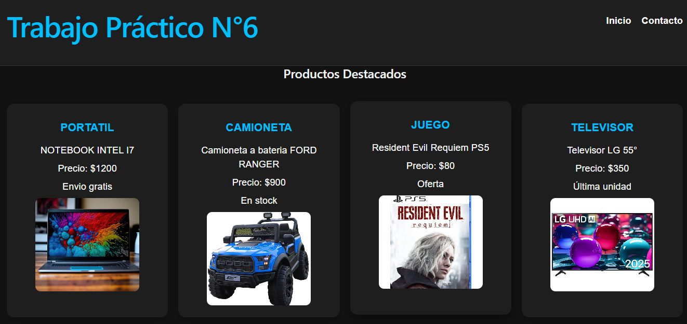
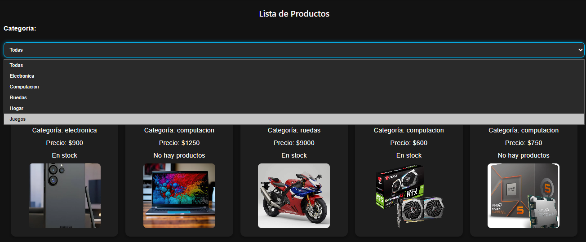
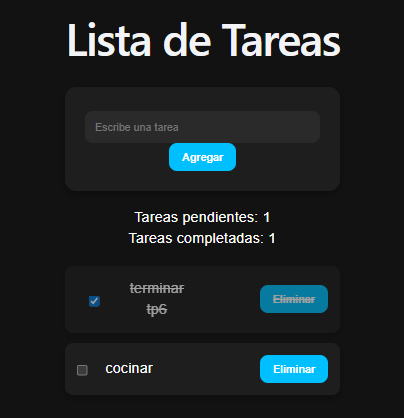
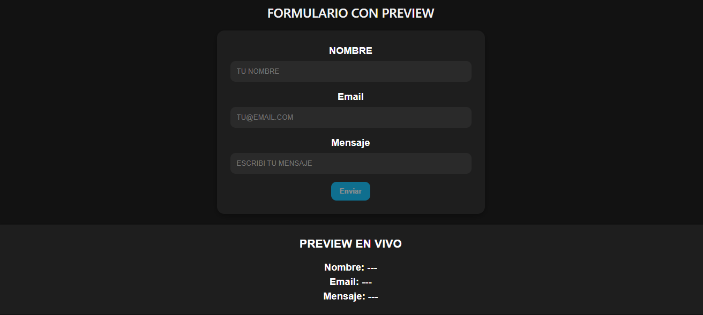

## Trabajo Practico N° 6 "App con React"

Aplicación web desarrollada con React y Vite que reúne distintos componentes interactivos, incluyendo un contador dinámico, una lista de tareas con gestión de estados, un catálogo de productos filtrable, tarjetas informativas reutilizables y un formulario de contacto con actualización en tiempo real.

---

## Tecnologías usadas

- **React 19** — Librería principal para la interfaz de usuario
- **Vite** — Bundler y entorno de desarrollo
- **JavaScript (JSX)** — Lógica y componentes
- **CSS** — Estilos (variables, grid, flexbox, responsive design)

---

## Funcionalidades implementadas
- Header con navegación interna entre secciones principales
- Sistema de Cards reutilizables con imágenes, descripción y precios
- Contador interactivo con incremento, decremento, reset y control de límite mínimo
- Catálogo de productos con filtrado dinámico por categorías y opción de visualizar únicamente productos en stock
- Lista de tareas (TodoApp) con funcionalidades para agregar, completar y eliminar tareas, además de contadores automáticos
- Formulario de contacto con validación básica, actualización en tiempo real y vista previa de datos ingresados
- Footer dinámico con año actualizado automáticamente
- Diseño responsive adaptable a distintos dispositivos
- Tema visual personalizado utilizando variables CSS globales, sombras, efectos hover y estilos modernos reutilizables
- Arquitectura basada en componentes reutilizables desarrollados con React Hooks (useState)
---

## Instalación y ejecución

```bash
# Clonar el repositorio
git clone <https://github.com/GabrielUlunqui/TP-6-APP-CON-REACT.git >
cd mi-app

# Instalar dependencias
npm install

# Iniciar servidor de desarrollo
npm run dev
```

La aplicación se abrirá en `http://localhost:5173` por defecto.

---

## Capturas de pantalla










---
## Estructura del proyecto

```
mi-app/
├── public/
├── src/
│   ├── assets/
│   │   ├── auto.avif
│   │   ├── bici.avif
│   │   ├── celular.png
│   │   ├── computadora.avif
│   │   ├── heladera.jpg
│   │   ├── juego.jpg
│   │   ├── moto.jpg
│   │   ├── placa.png
│   │   ├── procesador.jpg
│   │   └── tv.avif 
│   ├── componentes/
│   │   ├── Cards.jsx
│   │   ├── ContacForm.jsx
│   │   ├── Contador.jsx
│   │   ├── Footer.jsx
│   │   ├── Header.jsx
│   │   ├── listacartas.jsx
│   │   ├── ProductosList.jsx
│   │   ├── productos.jsx
│   │   └── TodoApp.jsx
│   ├── App.css
│   ├── App.jsx
│   ├── index.css
│   └── main.jsx
├── index.html
├── package.json
├── vite.config.js
└── README.md
```

---

## Autor

**GABRIEL ULUNQUI** 